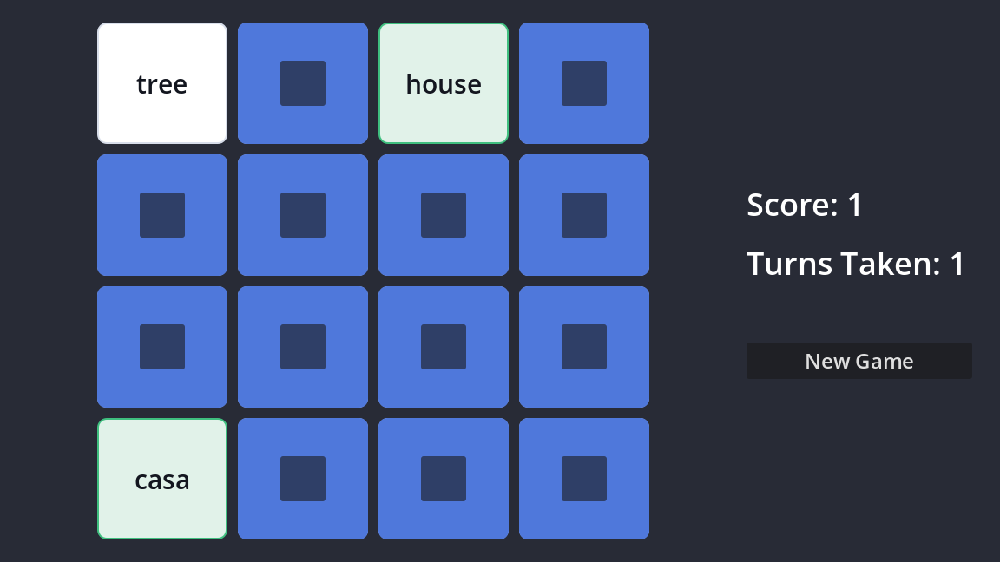

# Matching Game — a beginner Godot course

A memory / pairs game built in **Godot 4.7**, and an eight-chapter course that
teaches beginners to build it from an empty project.

The game reads its cards from a **CSV file**, so the same game can be re-skinned
for any subject — Spanish vocabulary, times tables, chemical symbols, French
verbs — without changing a line of code.



## Running the game

Open the folder in Godot 4.7 or newer and press ++f5++.

## Changing the cards

Decks live in `decks/` as CSV, one row per card face:

```csv
pair,text,image
dog,perro,
dog,dog,
sun,sol,res://art/sun.svg
sun,sun,
```

Cards sharing a `pair` value match each other, so a pair can be word/word,
word/picture, or picture/picture. The `pair` value is never shown to the player —
it is just a label tying two rows together.

Point the `Game` node's **Deck Path** at any CSV in the Inspector. **Rows** and
**Columns** set the board size; the total must be even and the deck needs at
least that many pairs.

> [!IMPORTANT]
> Godot treats `.csv` files as translation files by default. After adding a new
> deck, select it in the FileSystem panel, open the **Import** tab, set
> **Import As** to **Keep File (exported as is)** and click **Reimport**. Skipping
> this can break deck loading in exported builds.

Bundled decks: `spanish.csv`, `times-tables.csv`, `pictures.csv`.

## The course

Eight chapters, roughly 20 minutes each, building the game from scratch. Each
ends with a working game and a few quiz questions.

| # | Chapter | Concept |
|---|---|---|
| 1 | Scenes and nodes | how Godot projects are structured |
| 2 | Building a card | reusable scenes, Control layout |
| 3 | Your first script | scripts, `_ready()`, `@onready` |
| 4 | Signals | decoupled communication |
| 5 | Building the board | instancing, containers |
| 6 | The rules | game state, `await` |
| 7 | Loading decks from CSV | `FileAccess.get_csv_line()` |
| 8 | Make it yours | `@export`, extension exercises |

`docs/videos.md` has recording scripts for a short companion video per chapter,
with shot lists and timings. The videos have not been made yet.

### The published course

The course is maintained and published from the **godot-edu** repo:

```
~/jeremy-oz/eduspace/godot-edu/tile-matching-game/
```

→ `lessons.eduspace.cc/ac/tile-matching-game/`

Treat that copy as canonical for the prose; keep this project's code in step
with its chapter listings.

Quizzes are rendered by [mkdocs-quiz](https://github.com/ewels/mkdocs-quiz).

## Project layout

```
main.tscn            the game scene
scenes/card.tscn     one card, instanced 16 times
scripts/card.gd      a card: shows content, reports clicks
scripts/board.gd     builds the grid of cards
scripts/game.gd      the rules, score and turns
scripts/deck.gd      reads CSV decks
decks/*.csv          card content
art/*.svg            picture art
docs/                the course
```

## Credit

The idea of teaching Godot through a tile-matching game came from
[GodotTileMatchingGameExample](https://github.com/Goldenlion5648/GodotTileMatchingGameExample)
by Goldenlion5648 / ThinkWithGames.

**None of that project's code is used here.** It builds the board from a
`TileMap` with atlas coordinates in a single script; this is an independent
rewrite on `Control` nodes — one scene per card, signals, and CSV-driven decks.
The acknowledgement is for the idea, not for code.

Game code MIT, course prose CC BY 4.0 — see `LICENSE`.
