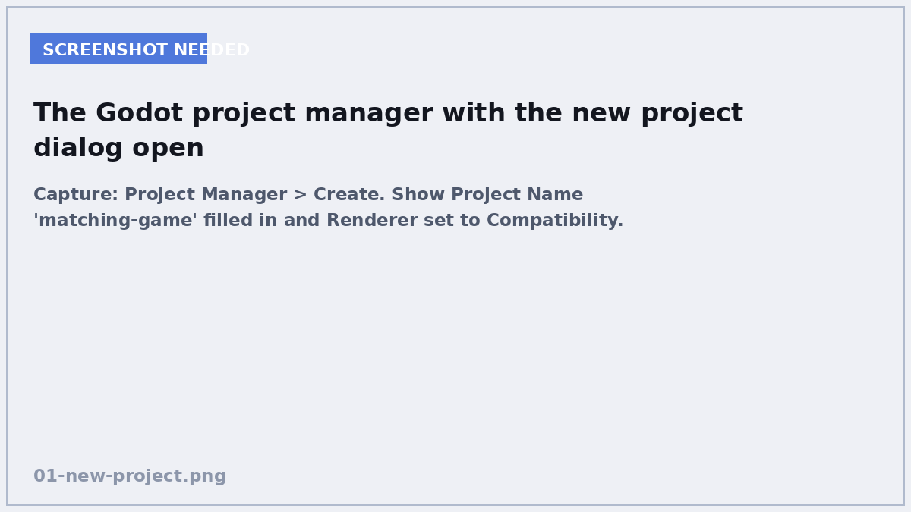
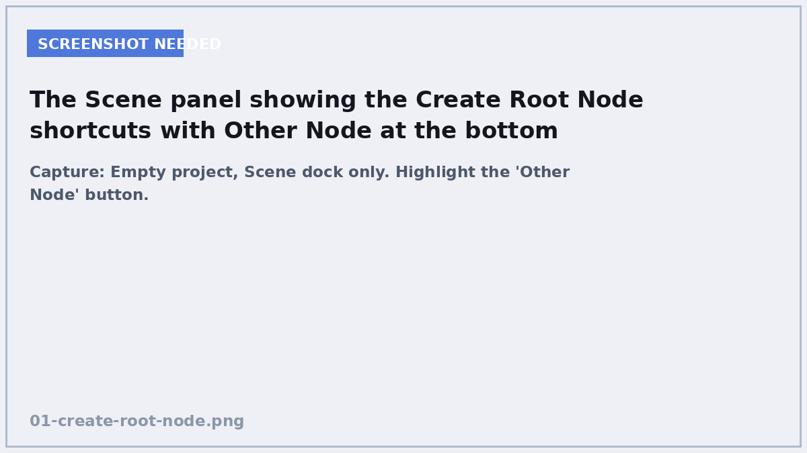
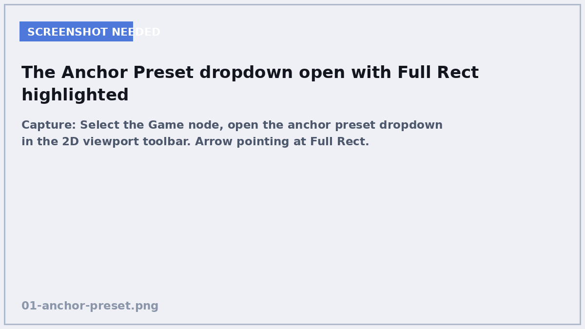
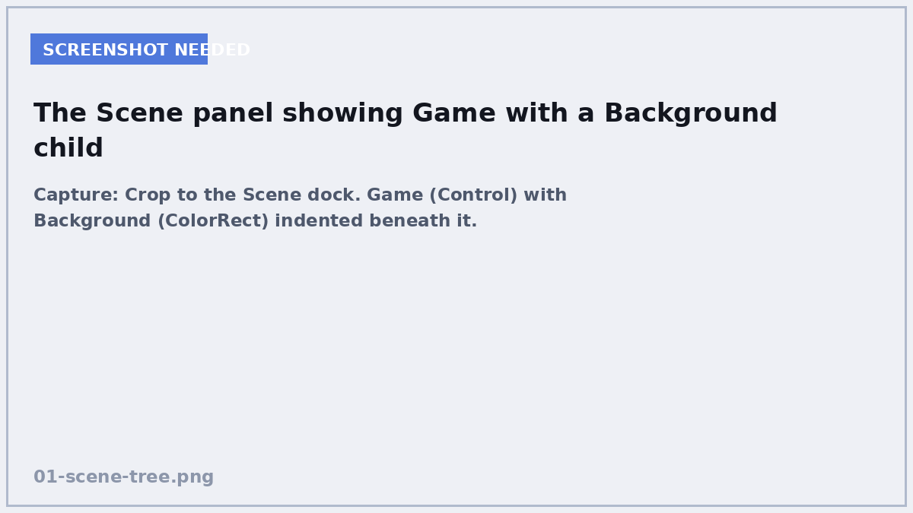
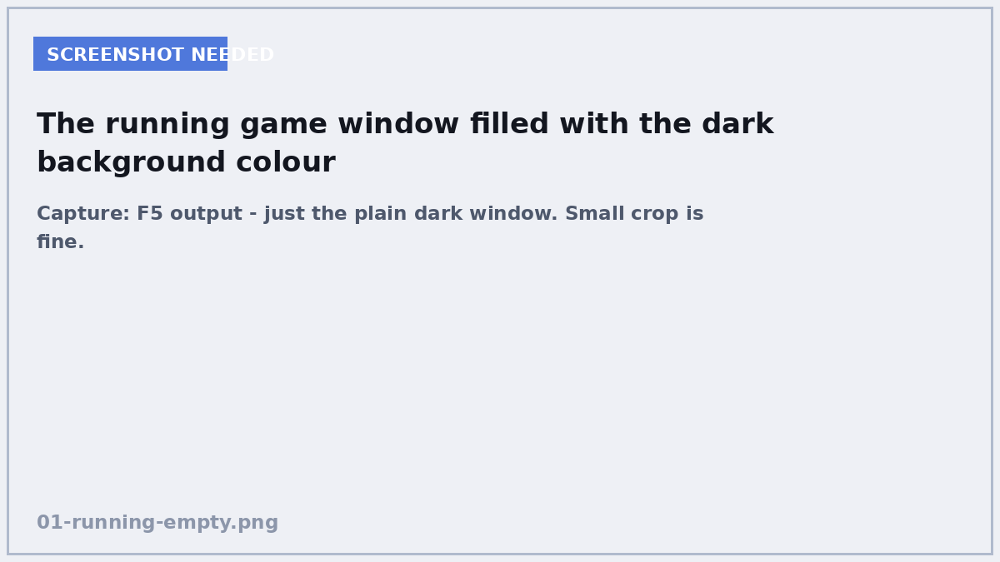

# 1. Scenes and nodes

**In this chapter:** you will set up the project and learn the one idea that
everything else in Godot is built on.

## Make the project


<!-- SCREENSHOT: Project Manager > Create. Show Project Name 'matching-game' filled in and Renderer set to Compatibility. -->

Open Godot and click **Create** (or **New Project**).

- **Project Name:** `matching-game`
- **Project Path:** anywhere you like — make a new empty folder for it
- **Renderer:** **Compatibility**

!!! info "Why Compatibility?"
    It is the renderer that runs on the widest range of machines, including old
    school laptops and Chromebooks. Our game is 2D text and pictures, so we
    gain nothing from the fancier renderers.

Click **Create & Edit**. You now have an empty project.

## The one big idea

Godot has exactly two words you must understand, and they are simpler than they
sound.

A **node** is one thing that does one job. A node that shows text. A node that
plays a sound. A node that arranges things in a grid. Godot gives you a few
hundred of them and each is small and boring on its own.

A **scene** is a group of nodes arranged in a tree, saved as a file.

That is genuinely it. A card is a scene. The board is a scene. The whole game
is a scene. And here is the trick that makes Godot click:

!!! quote "The rule worth remembering"
    **Any scene can be used as a node inside another scene.**

So you build a Card scene once, and then drop 16 copies of it into your game.
Change the Card scene, and all 16 change. You will do exactly this in Chapter 5.

## Build the root node


<!-- SCREENSHOT: Empty project, Scene dock only. Highlight the 'Other Node' button. -->

Look at the **Scene** panel in the top left. It says *Create Root Node* with a
few shortcuts. Ignore those and click **Other Node**.

Search for `Control` and pick it. Click **Create**.

A `Control` is the base node for anything that is part of the user interface —
buttons, labels, panels, layouts. Our whole game is user interface, so `Control`
is the right root.

Now rename it. Double-click the node's name in the Scene panel and call it
`Game`.

### Make it fill the screen


<!-- SCREENSHOT: Select the Game node, open the anchor preset dropdown in the 2D viewport toolbar. Arrow pointing at Full Rect. -->

Your `Game` node is currently a tiny box in the corner. With `Game` selected,
look at the toolbar above the viewport for a dropdown that appears when a
Control node is selected — it is called **Anchor Preset** and shows a small
square icon.

Click it and choose **Full Rect** (the bottom option, a filled square).

Your `Game` node now stretches to fill the whole window, and will keep filling
it if the player resizes the window.

!!! tip "Anchors in one sentence"
    Anchors tell a Control node *what to stick to* when the window changes size.
    Full Rect means "stick to all four edges", which is what you want for a
    background or a whole-screen layout.

## Add a background


<!-- SCREENSHOT: Crop to the Scene dock. Game (Control) with Background (ColorRect) indented beneath it. -->

Right-click the `Game` node → **Add Child Node** → search `ColorRect` → Create.

Rename it to `Background`, set its anchor preset to **Full Rect** as well, and
in the **Inspector** on the right, click the **Color** property and pick a dark
colour. Something like `282C36` typed into the hex box works nicely.

Your Scene panel should now look like this:

```
Game            (Control)
└── Background  (ColorRect)
```

That indentation *is* the tree. `Background` is a **child** of `Game`. Children
are drawn on top of their parent, and they move with it.

## Save and run


<!-- SCREENSHOT: F5 output - just the plain dark window. Small crop is fine. -->

Press ++ctrl+s++ (++cmd+s++ on Mac) and save the scene as `main.tscn` in the
project root.

Now press ++f5++ to run the project. Godot will ask you to choose a main scene —
pick `main.tscn`. You should get a window filled with your dark colour.

That is not much of a game yet. But the structure is right, and you have seen
the loop you will repeat for the rest of the course: **add a node, set it up,
save, run.**

## Check yourself

<quiz>
What is a *scene* in Godot?
- [ ] A single node that does one job
- [x] A group of nodes arranged in a tree and saved as a file
- [ ] A picture used as a background
- [ ] The code file attached to a node

A scene is a tree of nodes saved to a `.tscn` file. The important part is that a
saved scene can then be used as a node inside another scene — that is how you
will build 16 cards from one Card scene.
</quiz>

<quiz>
You want a node to stretch and fill the window even when the player resizes it. Which anchor preset do you use?
- [ ] Centre
- [ ] Top Left
- [x] Full Rect
- [ ] Bottom Wide

Full Rect anchors the node to all four edges, so it grows and shrinks with the
window.
</quiz>

<quiz>
In the scene tree below, `Background` is a [[child]] of `Game`.

```
Game
└── Background
```

---

Indentation in the Scene panel shows the parent-child relationship. Children are
drawn on top of their parent and move with it.
</quiz>

## Where you are

```
matching-game/
└── main.tscn        Game (Control)
                     └── Background (ColorRect)
```

Next you will build the thing the whole game is made of: a single card.

[Chapter 2: Building a card →](02-building-a-card.md)
