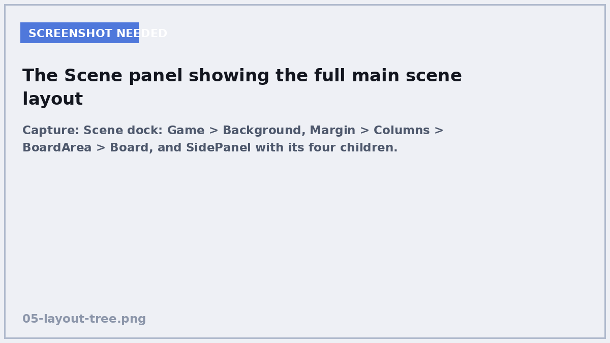
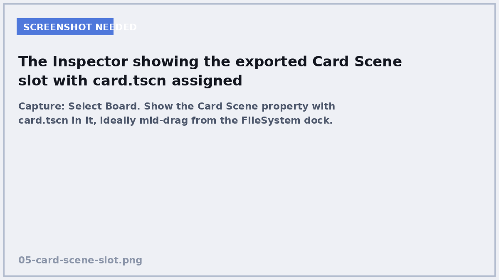

# 5. Building the board

**In this chapter:** you will turn one card into sixteen — while the game is
running. This is the chapter where Godot starts to feel powerful.

## Instancing

You built a Card scene. Right now there is exactly one of it, sitting in a file.

**Instancing** means making a copy of a saved scene and dropping it into the
running game. Each copy is independent — its own word, its own face-up state —
but they all come from the one file. Improve `card.tscn` and all sixteen copies
improve.

This is the single most useful thing in Godot. Enemies, bullets, tiles,
inventory slots, menu buttons: all the same pattern.

```gdscript
var card = card_scene.instantiate()   # make one
add_child(card)                       # put it in the tree
```

Two lines. That is instancing.

## Add the board to the main scene


<!-- SCREENSHOT: Scene dock: Game > Background, Margin > Columns > BoardArea > Board, and SidePanel with its four children. -->

Open `main.tscn`. You will build a small layout so the board sits nicely next to
a score panel.

Add these nodes, each as a child of the one above it:

1. `Game` → **MarginContainer**, named `Margin`, anchor preset **Full Rect**.
   Under **Theme Overrides → Constants**, set all four margins to `32`.
2. `Margin` → **HBoxContainer**, named `Columns`.
3. `Columns` → **CenterContainer**, named `BoardArea`. In the Inspector set
   **Layout → Container Sizing → Horizontal** to **Fill, Expand**.
4. `BoardArea` → **GridContainer**, named `Board`. Set **Columns** to `4`, and
   under **Theme Overrides → Constants** set **H Separation** and
   **V Separation** to `12`.

Then a panel for the score:

5. `Columns` → **VBoxContainer**, named `SidePanel`. Set
   **Container Sizing → Vertical** to **Shrink Center**, and separation to `18`.
6. `SidePanel` → three **Label** nodes named `ScoreLabel`, `TurnsLabel` and
   `MessageLabel`, and one **Button** named `RestartButton` with text
   `New Game`.

Set the font size of `ScoreLabel` and `TurnsLabel` to `36` so they are readable.

!!! tip "Containers do the maths"
    Notice you never typed a single x/y position. `HBoxContainer` puts things
    side by side, `VBoxContainer` stacks them, `CenterContainer` centres its
    child, and `GridContainer` makes a grid. Let them do the work — hard-coded
    positions break the moment anything resizes.

### Unique names


<!-- SCREENSHOT: Right-click Board in the Scene dock. Second shot or same frame showing the % badge after applying. -->

Select `Board` and, in the Scene panel, right-click it → **Access as Unique
Name**. A `%` appears next to it. Do the same for `ScoreLabel`, `TurnsLabel`,
`MessageLabel` and `RestartButton`.

This lets you write `%Board` in code instead of
`$Margin/Columns/BoardArea/Board`. If you later move things around in the
layout, `%Board` keeps working. Long node paths are one of the most common
sources of breakage in Godot projects, and this avoids them.

## The board script


<!-- SCREENSHOT: Select Board. Show the Card Scene property with card.tscn in it, ideally mid-drag from the FileSystem dock. -->

Attach a script to the `Board` node at `res://scripts/board.gd`, template
**Empty**.

```gdscript
class_name Board
extends GridContainer

signal card_flipped(card: Card)

@export var card_scene: PackedScene
@export var card_size := Vector2(150, 140)
```

`@export` puts a variable in the **Inspector** so you can set it without editing
code. `card_scene` is typed `PackedScene` — that is what a saved `.tscn` is when
you load it.

Save the script, select `Board` in the Scene panel, and you will see a
**Card Scene** slot in the Inspector. Drag `scenes/card.tscn` from the FileSystem
panel into it.

!!! note "Why not just `load()` the card in code?"
    You could. But exporting it means someone can swap in a different card
    design without touching a line of code — and *you* get told immediately if
    the file goes missing, instead of at run time.

### Building the cards

```gdscript
func build(deck: Array, column_count: int) -> void:
	columns = maxi(1, column_count)
	clear()

	for entry in deck:
		var card: Card = card_scene.instantiate()
		card.custom_minimum_size = card_size
		add_child(card)
		card.setup(entry["pair"], entry["text"], entry["image"])
		card.flipped.connect(_on_card_flipped)
```

Walk through that loop, because the **order matters**:

1. `instantiate()` makes a copy of the Card scene. It exists, but is not in the
   tree yet.
2. `add_child(card)` puts it in the tree. **This is when `_ready()` runs**, and
   therefore when the card's `@onready` variables get filled in.
3. Only *now* is it safe to call `setup()`, because `setup()` touches
   `word_label` — which did not exist a moment ago.
4. `connect` subscribes to that card's `flipped` signal.

Swap steps 2 and 3 and you get `Cannot call method 'set_text' on a null value`.
This trips up nearly everyone once.

### Clearing the old board

```gdscript
func clear() -> void:
	for child in get_children():
		child.queue_free()
		remove_child(child)
```

`queue_free()` tells Godot to delete the node safely at the end of the frame —
deleting it instantly while it is mid-signal would crash. `remove_child()` takes
it out of the tree straight away so it does not appear in `get_children()` while
we rebuild.

### Passing the signal on

```gdscript
func cards() -> Array[Card]:
	var found: Array[Card] = []
	for child in get_children():
		if child is Card:
			found.append(child)
	return found


func _on_card_flipped(card: Card) -> void:
	card_flipped.emit(card)
```

The Board hears every card's signal and re-emits a single `card_flipped` signal
of its own. The Game then listens to *one* thing instead of sixteen. Each layer
only talks to its neighbour.

## The whole file

`scripts/board.gd`:

```gdscript
class_name Board
extends GridContainer

signal card_flipped(card: Card)

@export var card_scene: PackedScene
@export var card_size := Vector2(150, 140)


func build(deck: Array, column_count: int) -> void:
	columns = maxi(1, column_count)
	clear()

	for entry in deck:
		var card: Card = card_scene.instantiate()
		card.custom_minimum_size = card_size
		add_child(card)
		card.setup(entry["pair"], entry["text"], entry["image"])
		card.flipped.connect(_on_card_flipped)


func clear() -> void:
	for child in get_children():
		child.queue_free()
		remove_child(child)


func cards() -> Array[Card]:
	var found: Array[Card] = []
	for child in get_children():
		if child is Card:
			found.append(child)
	return found


func _on_card_flipped(card: Card) -> void:
	card_flipped.emit(card)
```

Nothing calls `build()` yet, so running the game still shows an empty screen.
Chapter 6 fixes that.

## Check yourself

<quiz>
Why must `add_child(card)` come *before* `card.setup(...)`?
- [ ] Because `setup()` needs the card to be visible
- [x] Because `_ready()` and the `@onready` variables only run once the node is in the tree
- [ ] Because `add_child()` returns the card
- [ ] It does not matter which order they go in

`setup()` uses `word_label`, which is `@onready`. Until `add_child()` puts the
card in the tree, that variable is `null` and you get a crash.
</quiz>

<quiz>
What does `@export` do?
- [ ] Saves the variable to a file
- [ ] Makes the variable available to other scripts
- [x] Shows the variable in the Inspector so it can be set without editing code
- [ ] Sends the variable to another scene

Exported variables appear in the Inspector. It is how you make a scene
configurable by someone who is not reading the code — including future you.
</quiz>

<quiz>
Why does the Board re-emit its own `card_flipped` signal instead of letting the Game connect to all 16 cards?
- [ ] Because signals cannot have more than one listener
- [x] So the Game only has to listen to one thing, and does not need to know how many cards exist
- [ ] Because cards are deleted every turn
- [ ] To make the signal fire faster

Each layer talks only to its neighbour. The Game asks the Board for news; the
Board deals with the cards. Add a 17th card and the Game does not change.
</quiz>

<quiz>
Making a copy of a saved scene while the game is running is called [[instancing]].

---

`card_scene.instantiate()` creates one copy. It is the same pattern you would
use for enemies, bullets or inventory slots in any other project.
</quiz>

[Chapter 6: The rules of the game →](06-the-rules.md)
