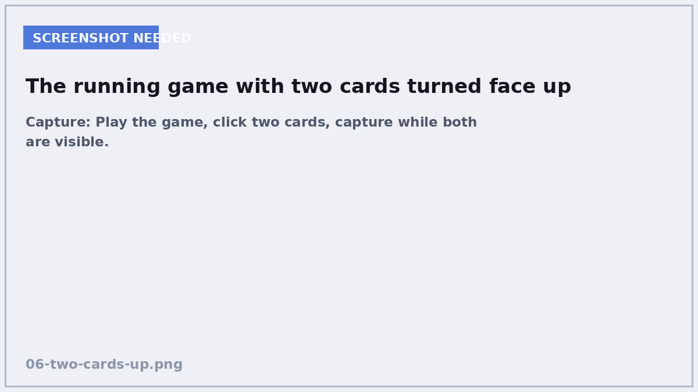
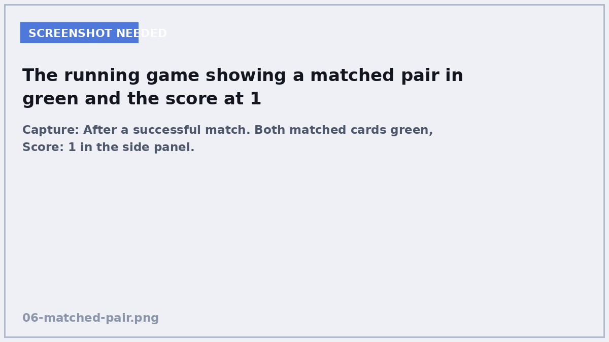

# 6. The rules of the game

**In this chapter:** the game becomes playable. Two cards, do they match, keep
score, flip them back if not.

## Attach the game script

Open `main.tscn`, select the `Game` root node, and attach a script at
`res://scripts/game.gd`, template **Empty**.

```gdscript
extends Control

@export var rows := 4
@export var columns := 4
@export var flip_back_delay := 1.2
```

No `class_name` this time — nothing else needs to refer to this type.

## What the game must remember

```gdscript
var score := 0
var turns := 0
var pairs_to_find := 0

var first_card: Card = null
var second_card: Card = null
var is_busy := false
```

`first_card` and `second_card` hold the two cards currently face up. `null`
means "nothing there yet", which is how we tell whether this click is the first
or second of a turn.

`is_busy` deserves a moment. When two cards do not match we leave them visible
for a second so the player can see them. During that pause the player can still
click — and without a guard they could flip a third and fourth card and break
the whole thing. `is_busy` is a small flag that says "not now".

!!! tip "This is a real bug, not a hypothetical"
    Games that let you click during animations are a classic source of weird
    behaviour. Any time you make the player wait, ask yourself what happens if
    they click anyway.

## Node references

```gdscript
@onready var board: Board = %Board
@onready var score_label: Label = %ScoreLabel
@onready var turns_label: Label = %TurnsLabel
@onready var message_label: Label = %MessageLabel
```

This is where the unique names from Chapter 5 pay off.

## Starting up

```gdscript
func _ready() -> void:
	board.card_flipped.connect(_on_card_flipped)
	%RestartButton.pressed.connect(start_new_game)
	start_new_game()
```

Two connections and a kick-off. Notice the game connects to the *board's*
signal, and never touches an individual card's signal at all.

## Dealing a new board

For now, build a deck by hand — Chapter 7 replaces this with a real file.

```gdscript
func start_new_game() -> void:
	score = 0
	turns = 0
	first_card = null
	second_card = null
	is_busy = false
	message_label.text = ""

	var total_cards := rows * columns
	if total_cards % 2 != 0:
		push_error("A %dx%d board has %d squares, which cannot be filled with pairs"
			% [rows, columns, total_cards])
		return

	pairs_to_find = total_cards / 2

	# temporary deck - replaced in Chapter 7
	var words := ["dog", "cat", "house", "book", "water", "sun", "moon", "tree"]
	var deck := []
	for i in range(pairs_to_find):
		var word: String = words[i % words.size()]
		deck.append({"pair": word, "text": word, "image": ""})
		deck.append({"pair": word, "text": word, "image": ""})
	deck.shuffle()

	board.build(deck, columns)
	update_labels()
```

`%` is the remainder operator — `total_cards % 2 != 0` asks "is this an odd
number?". An odd board cannot be filled with pairs, so we stop early and say
why. `push_error()` writes a red message to the Output panel.

## The turn


<!-- SCREENSHOT: Play the game, click two cards, capture while both are visible. -->

This is the heart of the game.

```gdscript
func _on_card_flipped(card: Card) -> void:
	if is_busy or card.is_face_up or card.is_matched:
		return

	card.flip_up()

	if first_card == null:
		first_card = card
		return

	second_card = card
	turns += 1

	if first_card.pair_id == second_card.pair_id:
		_handle_match()
	else:
		await _handle_mismatch()

	update_labels()
	_check_for_win()
```

Read it as English: ignore the click if we are busy or this card is already
dealt with. Turn it over. If it is the first card of the turn, remember it and
wait. Otherwise it is the second, so count a turn and compare the two ids.

## Match and mismatch

```gdscript
func _handle_match() -> void:
	first_card.mark_matched()
	second_card.mark_matched()
	score += 1
	_clear_selection()


func _handle_mismatch() -> void:
	is_busy = true
	await get_tree().create_timer(flip_back_delay).timeout
	if is_instance_valid(first_card):
		first_card.flip_down()
	if is_instance_valid(second_card):
		second_card.flip_down()
	_clear_selection()
	is_busy = false


func _clear_selection() -> void:
	first_card = null
	second_card = null
```

### `await` — waiting without freezing

```gdscript
await get_tree().create_timer(1.2).timeout
```

That line means: **pause this function for 1.2 seconds, then carry on from
here.** The rest of the game keeps running — animations play, the window still
responds. Only this function is paused.

If you instead wrote a loop that span for 1.2 seconds, the entire game would
freeze solid, including the window itself.

`create_timer()` makes a one-shot timer, and `.timeout` is the signal it fires
when it finishes. So `await` here means "wait for that signal".

Because `_handle_mismatch()` contains an `await`, the caller has to `await` it
too — that is the `await _handle_mismatch()` you wrote above. Miss it and the
score updates before the cards have flipped back.

### Why `is_instance_valid()`?

During that 1.2 second pause the player might press **New Game**. That deletes
every card, including the two we were about to flip back. `is_instance_valid()`
asks "does this still exist?" before touching it.

!!! warning "The general lesson"
    After an `await`, the world may have changed. Anything you remembered before
    the wait might be gone. Check before you use it.

## Winning, and the labels

```gdscript
func _check_for_win() -> void:
	if pairs_to_find > 0 and score >= pairs_to_find:
		message_label.text = "All pairs found in %d turns!" % turns


func update_labels() -> void:
	score_label.text = "Score: %d" % score
	turns_label.text = "Turns Taken: %d" % turns
```

`"Score: %d" % score` puts a whole number where the `%d` is. `%s` would work for
any value.

## Play it


<!-- SCREENSHOT: After a successful match. Both matched cards green, Score: 1 in the side panel. -->

Press ++f5++. You should get a full board of face-down blue cards. Click two.
They turn over. Matching pairs stay up and go green; the rest flip back after a
moment. The score climbs. Find them all and you get a message.

**You have made a game.** Everything after this is making it yours.

## Check yourself

<quiz>
What does `await get_tree().create_timer(1.2).timeout` do?
- [ ] Freezes the whole game for 1.2 seconds
- [x] Pauses just this function for 1.2 seconds while the rest of the game keeps running
- [ ] Runs the next line 1.2 seconds early
- [ ] Repeats the function every 1.2 seconds

`await` suspends only the function it is in. This is why you can wait without
the window locking up.
</quiz>

<quiz>
What is `is_busy` for?
- [ ] Making the game run faster
- [ ] Stopping the timer
- [x] Ignoring clicks while a mismatched pair is still being shown
- [ ] Remembering which card was clicked first

Without it, a player could click more cards during the pause and end up with
three or four face up at once.
</quiz>

<quiz>
Why check `is_instance_valid(first_card)` after the `await`?
- [ ] To check the cards match
- [ ] To make sure the card is face up
- [x] Because the card may have been deleted during the pause, for example by pressing New Game
- [ ] Because `await` always makes variables null

After an `await`, time has passed and the world may have changed underneath you.
Anything you held on to might no longer exist.
</quiz>

<quiz>
`first_card` holds the value [[null]] when no card has been turned over yet this turn.

---

Using `null` as "nothing here yet" is how the code tells a first click apart from
a second one.
</quiz>

[Chapter 7: Loading decks from CSV →](07-loading-decks-from-csv.md)
