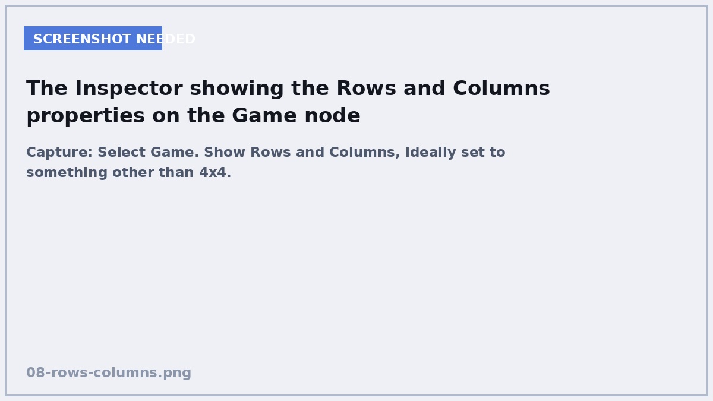
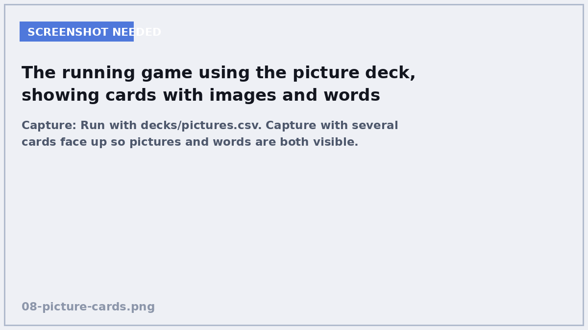
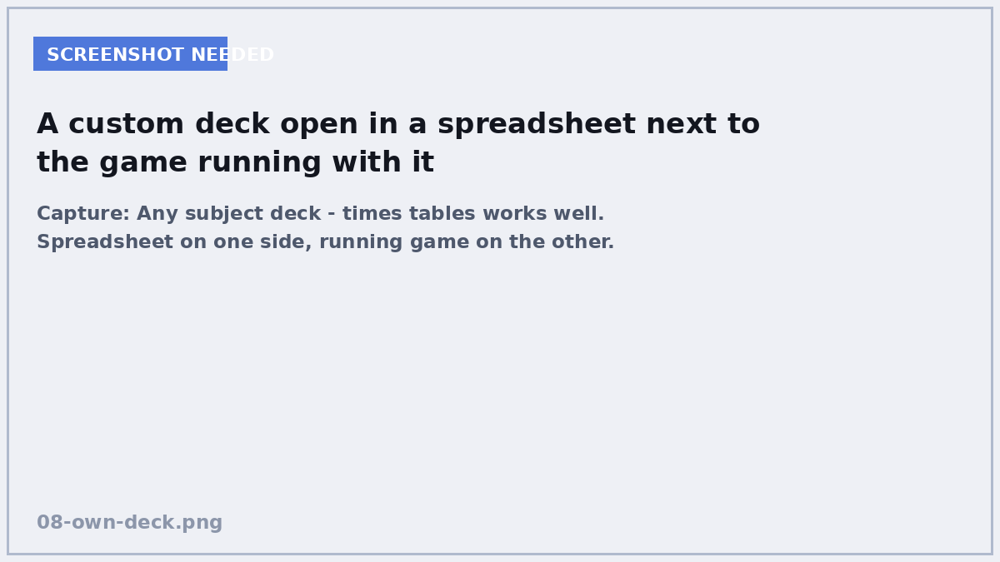

# 8. Make it yours

**In this chapter:** different board sizes, pictures on cards, your own deck —
and some ideas for where to take it next.

## Change the board size


<!-- SCREENSHOT: Select Game. Show Rows and Columns, ideally set to something other than 4x4. -->

You already exported `rows` and `columns` back in Chapter 6. Select the `Game`
node and change them in the Inspector — no code, no restart of Godot.

| Board | Pairs needed | Good for |
|---|---|---|
| 2 × 2 | 2 | trying it out |
| 2 × 3 | 3 | very young students |
| 4 × 4 | 8 | the standard game |
| 4 × 5 | 10 | a longer game |
| 6 × 6 | 18 | serious memory work |

Two rules: the total must be an **even** number, and your deck needs at least
that many pairs. The code checks both and tells you in the Output panel if
something is wrong — try setting a 3 × 3 board and read the error.

## Add pictures


<!-- SCREENSHOT: Run with decks/pictures.csv. Capture with several cards face up so pictures and words are both visible. -->

Put an image in an `art/` folder — SVG or PNG both work — then reference it in
the `image` column:

```csv
pair,text,image
sun,sol,res://art/sun.svg
sun,sun,
```

The first card shows the Spanish word *with* a picture. The second shows just
the English word. They match because both are `sun`.

You can also leave `text` empty for a picture-only card:

```csv
star,,res://art/star.svg
star,estrella,
```

!!! warning "SVG text does not render"
    If you draw an SVG in Inkscape or Illustrator with words in it, Godot will
    import it as a **blank rectangle**. Godot's SVG reader does not handle text
    elements.

    If you need words in an SVG, convert them to outlines first — in Inkscape
    that is **Path → Object to Path**. Or just use the `text` column, which is
    easier and looks better anyway.

## Write your own deck


<!-- SCREENSHOT: Any subject deck - times tables works well. Spreadsheet on one side, running game on the other. -->

This is the real point of the whole course. Open a spreadsheet, make three
columns headed `pair`, `text`, `image`, and fill it in. Save as CSV into
`decks/`, set it to **Keep File (No Import)**, and point `deck_path` at it.

Some decks that work well:

=== "Times tables"

    ```csv
    pair,text,image
    6x7,6 × 7,
    6x7,42,
    8x9,8 × 9,
    8x9,72,
    7x7,7 × 7,
    7x7,49,
    ```

=== "Chemistry"

    ```csv
    pair,text,image
    sodium,Na,
    sodium,Sodium,
    iron,Fe,
    iron,Iron,
    potassium,K,
    potassium,Potassium,
    ```

=== "French verbs"

    ```csv
    pair,text,image
    tobe,être,
    tobe,to be,
    tohave,avoir,
    tohave,to have,
    togo,aller,
    togo,to go,
    ```

=== "Fractions"

    ```csv
    pair,text,image
    half,1/2,
    half,0.5,
    quarter,1/4,
    quarter,0.25,
    tenth,1/10,
    tenth,0.1,
    ```

Notice the `pair` value never appears on screen. It is just a label that ties
two cards together, so you can make it anything as long as it is unique and the
same on both rows.

## Where to take it next

Each of these is a genuine exercise, roughly in order of difficulty.

### Count the moves down, not up

Give the player a limited number of turns. Add `@export var turn_limit := 20`,
count downwards, and show a message when it hits zero. You already have
everything you need.

### Add a sound

Add an `AudioStreamPlayer` node to the Game scene, drop a short sound file into
its **Stream**, and call `play()` when a pair matches. Two lines of code and the
game feels twice as good — sound does a lot of heavy lifting.

### Animate the flip

Instead of `back.hide()`, use a `Tween` to shrink the card's width to zero,
swap the face, and grow it back:

```gdscript
var tween := create_tween()
tween.tween_property(self, "scale:x", 0.0, 0.1)
tween.tween_callback(back.hide)
tween.tween_property(self, "scale:x", 1.0, 0.1)
```

### Remember the best score

Use `FileAccess` — the same class you used for the deck — to write the lowest
turn count to a file in `user://`, and read it back when the game starts.
`user://` is a folder Godot gives you for saved data.

### A deck chooser

Scan the `decks/` folder with `DirAccess.get_files_at("res://decks")`, put the
names in an `OptionButton`, and let the player pick before starting. This is how
you would turn it into something a class could actually use.

### Try XML instead

Godot has an `XMLParser` class. Writing a `load_xml()` alongside `load_csv()`,
returning the same array of dictionaries, is a good exercise in seeing how the
*format* of data and the *use* of data are separate problems.

## What you have learned

Look back at what the game is made of:

- **Scenes and nodes**, and a scene reused as a node — the shape of every Godot
  project
- **Scripts** with `_ready()`, variables and functions
- **Signals**, so parts of a game can talk without being welded together
- **Instancing**, creating objects while the game runs
- **Containers**, so you never hard-code a position
- **`await`**, waiting without freezing
- **File reading**, getting real data into a game
- **`@export`**, changing a game without touching code

That list is most of what you need for a first real project. Not because the
game was clever, but because these eight things turn up in nearly everything.

## Check yourself

<quiz>
Your deck has 6 pairs and you set the board to 4 × 4. What happens?
- [ ] The game crashes
- [ ] Some cards appear blank
- [x] An error is printed and a smaller board is built with the 6 pairs available
- [ ] The same pairs are repeated to fill the board

`Deck.build()` reduces `pairs_needed` to what it actually has and calls
`push_error()`. `pairs_to_find` is then recalculated from the real deck size, so
the win check still works.
</quiz>

<quiz>
You draw a card in Inkscape with the word "chien" on it and save it as SVG. In Godot it appears blank. Why?
- [ ] The file is too large
- [ ] SVG is not supported in Godot
- [x] Godot's SVG importer does not render text elements
- [ ] The image needs to be a PNG

Convert the text to outlines first (**Path → Object to Path**), or put the word
in the `text` column of the CSV instead, which is simpler and sharper.
</quiz>

<quiz>
Which of these can you change without editing any code?
- [x] The number of rows and columns
- [x] Which deck file is loaded
- [ ] What happens when two cards match
- [x] The size of each card

Anything marked `@export` shows up in the Inspector. The matching rules live in
`game.gd` and would need code.
</quiz>

<quiz>
The `pair` column value is [[never]] shown to the player.

---

It is only a label tying two rows together. That is exactly why a pair can show
a word on one card and a picture on the other.
</quiz>

---

**You are done.** You built a game, and more importantly you can now change it
without asking anyone.

If you want a challenge: pick one idea from *Where to take it next*, and do not
look anything up until you have been stuck for ten minutes. Being stuck and
getting unstuck is the whole job.
